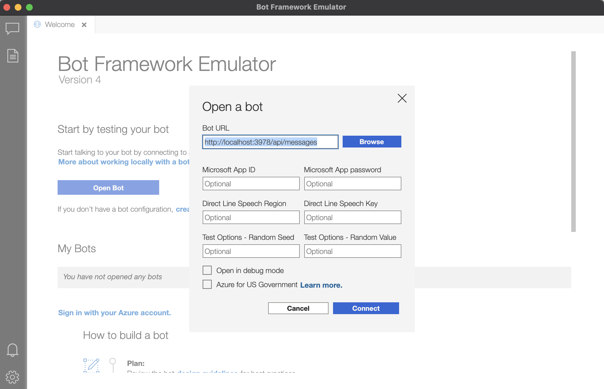
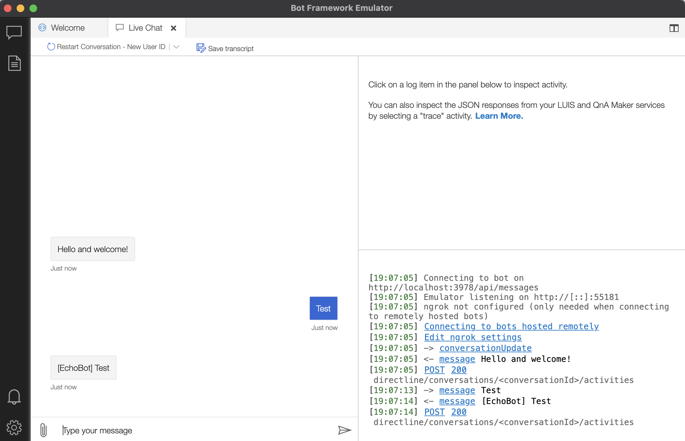

<!--
  © Copyright IBM Corporation 2022. All Rights Reserved.

  SPDX-License-Identifier: EPL-2.0
-->
# CONTRIBUTING GUIDELINES

## Contributing In General

Our project welcomes external contributions. If you have an itch, please feel free to scratch it.

To contribute code or documentation, please submit a **FIXME** [pull request](https://github.com/IBM/multi-bot-service-orchestrator/pulls).

A good way to familiarize yourself with the codebase and contribution process is
to look for and tackle low-hanging fruit in the **FIXME** [issue tracker](https://github.com/IBM/multi-bot-service-orchestrator/issues).
Before embarking on a more ambitious contribution, please quickly [get in touch](#communication) with us.

**Note: We appreciate your effort, and want to avoid a situation where a contribution
requires extensive rework (by you or by us), sits in backlog for a long time, or
cannot be accepted at all!**

### Proposing new features

If you would like to implement a new feature, please **FIXME** [raise an issue](https://github.com/IBM/multi-bot-service-orchestrator/issues)
before sending a pull request so the feature can be discussed. This is to avoid
you wasting your valuable time working on a feature that the project developers
are not interested in accepting into the code base.

### Fixing bugs

If you would like to fix a bug, please **FIXME** [raise an issue](https://github.com/IBM/multi-bot-service-orchestrator/issues) before sending a
pull request so it can be tracked.

### Merge approval

The project maintainers use LGTM (Looks Good To Me) in comments on the code
review to indicate acceptance. A change requires LGTM from one of the maintainers.

For a list of the maintainers, see the [MAINTAINERS.md](MAINTAINERS.md) page.

## Legal

### License and Copyright statement

Each source file must include a license header for [Eclipse Public License 2.0](https://opensource.org/licenses/EPL-2.0) Using the SPDX format is the simplest approach.
e.g.

```md
/*
  © Copyright IBM Corporation 2022. All Rights Reserved.

  SPDX-License-Identifier: EPL-2.0
*/
```

### Managing commit signature verification

We have tried to make it as easy as possible to make contributions. This
applies to how we handle the legal aspects of contribution. We use the
same approach - the [Developer's Certificate of Origin 1.1 (DCO)](https://github.com/hyperledger/fabric/blob/master/docs/source/DCO1.1.txt) - that the Linux® Kernel [community](https://elinux.org/Developer_Certificate_Of_Origin)
uses to manage code contributions.

We simply ask that when submitting a patch for review, the developer
must include a sign-off statement in the commit message.

Here is an example Signed-off-by line, which indicates that the
submitter accepts the DCO:

```txt
DCO 1.1 Signed-off-by: Random J Developer <random@developer.org>
```

You can include this automatically when you commit a change to your
local git repository using the following command:

```bash
git commit -s
```

Other tips:

- [How to create signature verification](https://docs.github.com/en/authentication/managing-commit-signature-verification)
- To configure your Git client to sign commits by default for a local repository, in Git versions 2.0.0 and above, run:  
   `git config commit.gpgsign true`.
- To sign all commits by default in any local repository on your computer, run:  
  `git config --global commit.gpgsign true`.

## Communication

Please feel free to connect with us via email: eimantas.pelikis@lt.ibm.com

## Setup

### Basic local setup

1. Install dependencies:

    ```bash
    yarn install
    ```

2. Create local config file (local.env) from the template (local.env.template)

3. Run app in watch mode (restarts on source changes):

    ```bash
    yarn watch
    ```

    > Ignore the "[DEP0128] DeprecationWarning: Invalid 'main' field" when you run app in watch mode.

> Note that `yarn compile` is designed to build source for production and one-time testing of your runtime. Don't forget to clean your workspace with `yarn clean` afterwards.

### Debugging (VS Code)

Create a new Node.js debug configuration, add `-r ts-node/register` and `-r dotenv/config` to node args and move the program to the args list (so VS Code doesn't look for outFiles). For example:

```JSON
{
  "configurations": [
      {
      "type": "node",
      "request": "launch",
      "name": "Debug Local",
      "env": {
        "DOTENV_CONFIG_PATH": "local.env"
      },
      "runtimeArgs": [
          "-r",
          "ts-node/register",
          "-r",
          "dotenv/config"
      ],
      "args": [
          "${workspaceFolder}/src/index.ts"
      ]
  }]
}
```

## Testing

- You are welcome to propose a testing framework for Unit testing;
- For SOE E2E testing we [Bot Framework Emulator](https://docs.microsoft.com/en-us/azure/bot-service/bot-service-debug-emulator?view=azure-bot-service-4.0&tabs=javascript) and access the local Bot instance on this endpoint: `http://localhost:3978/api/messages`

  

  

## Coding style guidelines

Note that this is a mono-repo setup, which contains multiple packages managed by `yarn` workspaces and `lerna`.

- We use strict TypeScript types, so `any` declaration is allowed;

More guidelines are coming in the near future.

## LICENSE

© Copyright IBM Corporation 2022. All Rights Reserved.
